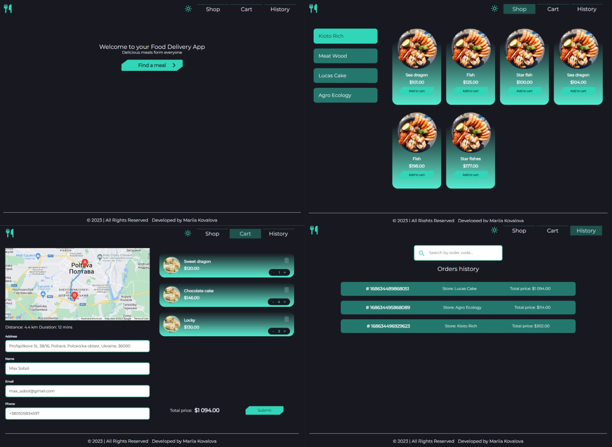

# FOOD DELIVERY SHOP

[Food Delivery Shop App](https://mariia-kovalova.github.io/food-delivery-shop/)
is a web application created using mockapi and
[Google Maps JavaScript API ](https://developers.google.com/maps/documentation/javascript/overview).

See the live page here -
[demo](https://mariia-kovalova.github.io/food-delivery-shop/)

## About the project

⭐ Choose a shop, then add goods to the cart.

⭐ Change amount of the items, change address by using google maps autocomplete
input or by clicking on the map.

⭐ Review history of orders, find the order by code.



## Stack, technologies and libraries

1. React
2. Axios
3. Redux Toolkit
4. Redux Persist
5. React Router
6. React Hook Form and Yup
7. React Helmet Async
8. Emotion Styled Components

## Starting the app

Create an API in the google developers console
[https://console.developers.google.com](https://console.developers.google.com),
make sure to enable billing for the google project, otherwise you may get a
warning as _development purposes only_.

Add a `.env` file or `.env.local` in the project root and specify your API key
as `REACT_APP_GOOGLE_MAPS_API_KEY=your_api_key_here`

In the project directory, you can run:

```
yarn install
yarn start
```

OR using npm

```
npm install
npm start
```
